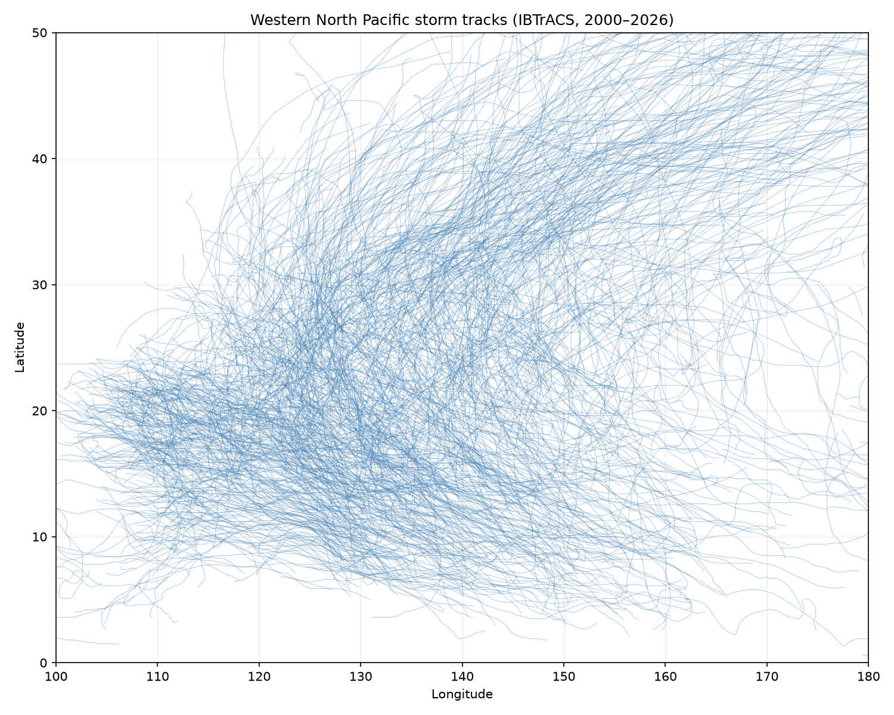

# Western North Pacific Storm Tracks

## The Phenomenon
Typhoons and tropical cyclones in the Western North Pacific. These are massive, rotating storm systems that form over warm ocean waters and move westward and northward, driven by atmospheric pressure gradients. I looked at them because their tracks and intensity directly affect Hong Kong and East Asia.

## The Source
[NOAA IBTrACS v04r01](https://www.ncei.noaa.gov/data/international-best-track-archive-for-climate-stewardship-ibtracs/v04r01/access/csv/ibtracs.WP.list.v04r01.csv)
The dataset contains historical storm records from 1848 onwards. For this project, I trimmed it to 2000¨C2026 to keep the file size under GitHub's limit, resulting in ~300,000 rows. Each row represents a 3-hourly observation of a storm's location (LAT, LON in degrees) and maximum sustained wind speed (WMO_WIND in knots).

## The Picture

## What It Shows and Hides
The map displays the collective "corridor" of storm tracks in the Western North Pacific, highlighting how intense (dark red) storms cluster in lower latitudes before curving northeast. It hides the exact temporal progression of individual storms and their physical size. Additionally, historical storms before 2000 are omitted to maintain a manageable file size for the repository.

## How to Run It
`uv run plot.py`